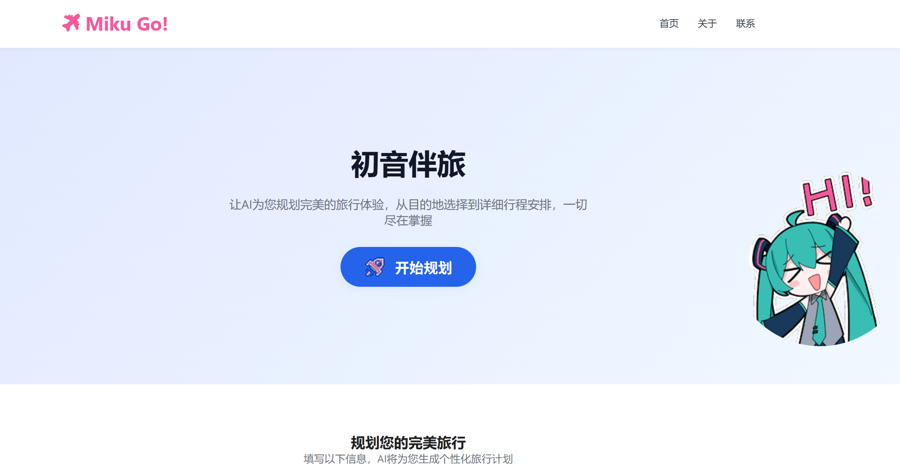
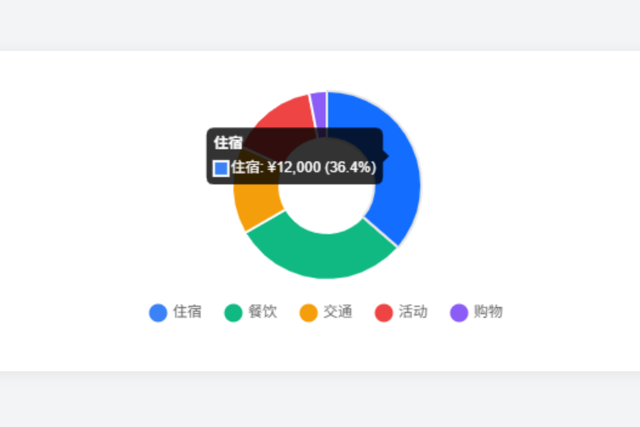

# Miku Go! - 初音伴旅



一个现代化的单页网站，借助前沿的 AI 技术，为用户量身定制个性化的旅行计划，让每一次旅行都成为独特的体验。

[展示视频见 B 站：BV1AkKDzEEeE](https://www.bilibili.com/video/BV1AkKDzEEeE/?share_source=copy_web&vd_source=dd65e5938f5f6dab5dc478dad590c5f9)

## 🌟 功能特色

### 1. 响应式设计

- **全设备适配**：采用完全响应式布局，无论您是使用桌面电脑、平板电脑还是移动设备，都能享受到流畅、舒适的浏览体验。
- **现代 UI 风格**：运用 Tailwind CSS v3 打造时尚、简洁的用户界面，结合平滑的动画和过渡效果，为用户带来视觉上的享受。

### 2. 智能旅行规划

- **友好输入界面**：用户友好的表单输入界面，让您轻松输入旅行相关信息。
- **多样偏好选择**：支持多种旅行偏好选择，如文化体验、自然风光、美食之旅等，满足不同用户的个性化需求。
- **实时预算控制**：通过实时预算滑块，您可以灵活控制旅行预算，确保旅行在您的经济承受范围内。
- **模拟 AI 生成**：模拟 AI 技术，快速生成符合您需求的个性化旅行计划。

### 3. 丰富的展示功能

- **详细行程安排**：提供每日详细行程安排，让您对旅行的每一天都有清晰的规划。
- **景点推荐**：为您推荐当地热门景点，并附带图片和评分，帮助您更好地了解景点情况。
- **餐厅推荐**：根据您的口味偏好，推荐当地特色餐厅，包含菜系和价格信息。
- **预算分配图表**：使用 Chart.js 生成直观的预算分配图表，让您清楚了解各项费用的支出情况。
  

### 4. 交互体验

- **平滑滚动导航**：页面采用平滑滚动导航，让您在浏览不同部分时更加流畅。
- **智能助手对话**：Miku 虚拟角色智能对话，了解更多信息。
- **加载动画效果**：加载动画效果让等待变得不再枯燥，提升用户体验。
- **错误提示和验证**：完善的错误提示和验证机制，确保您输入的信息准确无误。


## 🛠️ 技术栈

### 前端技术

- **HTML5**：使用语义化标签，不仅提高了代码的可读性，还增强了网站的无障碍支持，让更多用户能够方便地访问。
- **CSS3**
  - **Tailwind CSS v3**：通过 CDN 引入，提供了丰富的实用类，大大简化了样式编写过程。
  - **自定义动画和过渡效果**：结合 CSS3 的动画和过渡特性，为网站增添生动的交互效果。
  - **响应式设计**：利用媒体查询和弹性布局，实现网站在不同设备上的完美适配。
- **JavaScript (ES6+)**
  - **模块化代码组织**：采用模块化的代码结构，提高代码的可维护性和可扩展性。
  - **异步处理**：使用异步编程技术，如 `Promise` 和 `async/await`，确保在处理耗时操作时不会阻塞页面。
  - **DOM 操作和事件处理**：通过 JavaScript 进行 DOM 操作和事件处理，实现页面的交互功能。

### 第三方库

- **Chart.js**：用于生成各种类型的图表，如预算分配图表，直观展示数据。
- **Font Awesome**：提供丰富的图标库，为网站增添美观和实用性。

## 📁 项目结构

```
Miku_Go/
├── css/               # 样式资源目录，存放各类CSS文件
│   ├── common.css     # 通用样式，如全局字体、基础布局等
│   ├── generate.css   # 旅行计划生成页专属样式
│   ├── home.css       # 主页（首页）样式
│   ├── miku.css       # 聊天助手（Miku交互）样式
│   └── navbar.css     # 导航栏样式
├── iconfont/          # 图标字体资源，含字体文件与样式定义
│   ├── iconfont.css   # 图标字体使用的CSS规则
│   ├── iconfont.js    # （若有）动态加载图标相关脚本
│   └── [字体文件]     # 如 .woff、.woff2 等图标字体文件
├── images/            # 图片资源目录，存放页面所需静态图
│   ├── miku.png       # 初音形象等相关配图
│   └── [其他图片]     # 如景点示例图、装饰性背景图等
├── js/                # JavaScript 脚本目录
│   └── script.js      # 核心交互逻辑，如AI调用、表单处理等
├── index.html         # 主HTML文件，页面结构与组件挂载入口
├── README.md          # 项目说明文档
└── test.py            # 测试脚本，补充作用
```

## 🚀 快速开始

### 1. 克隆或下载项目

```bash
git clone <repository-url>
cd ai-view
```

### 2. 直接打开

- 在浏览器中直接打开 `index.html` 文件。
- 或者使用本地服务器（推荐）。

### 3. 使用本地服务器（推荐）

#### Python

```bash
python -m http.server 8000
```

#### Node.js

```bash
npx serve .
```

#### PHP

```bash
php -S localhost:8000
```

### 4. 访问网站

打开浏览器访问 `http://localhost:8000`

## 📱 使用说明

### 1. 导航

- 点击"开始规划"按钮或导航菜单中的"首页"，进入旅行规划页面。
- 在移动端，使用汉堡菜单进行导航。

### 2. 输入旅行信息

- **目的地**：输入您想要前往的城市名称，如：东京、巴黎、纽约等。
- **出发日期**：选择您的旅行开始日期。
- **旅行天数**：选择旅行的天数，范围为 1 - 30 天。
- **预算范围**：使用滑块选择您的预算范围，从 ¥1,000 到 ¥50,000。
- **旅行偏好**：选择多个偏好标签，如文化、美食、购物等。

### 3. 生成计划

- 点击"生成旅行计划"按钮。
- 等待 AI 处理（约 2 秒模拟时间）。
- 查看生成的个性化旅行计划。

### 4. 查看结果

- **概览卡片**：显示目的地、天数和预算等基本信息。
- **每日行程**：详细的时间安排，让您清楚了解每天的活动内容。
- **景点推荐**：带图片和评分的景点列表，帮助您选择感兴趣的景点。
- **餐厅推荐**：包含菜系和价格信息的餐厅列表，满足您的美食需求。
- **预算图表**：可视化预算分配，让您对费用支出一目了然。

## 🎨 设计特色

### 配色方案

- **主色调**：蓝色系 (#3b82f6)，给人一种专业、可靠的感觉。
- **辅助色**：绿色、橙色、紫色等，增添活力和层次感。
- **背景**：灰色渐变和白色，营造出简洁、舒适的视觉氛围。

### 交互效果

- **卡片悬停动画**：当鼠标悬停在卡片上时，会出现动画效果，增强交互性。
- **按钮点击反馈**：按钮点击时会有反馈效果，让用户感受到操作的响应。
- **平滑滚动**：页面滚动时采用平滑效果，提升浏览体验。
- **加载动画效果**：在数据加载过程中，显示加载动画，减少用户等待的焦虑感。

### 响应式布局

- **移动优先设计**：从移动设备的使用体验出发进行设计，确保在小屏幕上也能有良好的显示效果。
- **弹性网格系统**：使用弹性网格系统，使页面元素能够自适应不同的屏幕尺寸。
- **自适应图片**：图片能够根据屏幕大小自动调整，避免出现变形或拉伸的情况。

## 🔧 自定义配置

### 修改目的地数据

在 `script.js` 中的 `generateMockPlanData` 函数中添加新的目的地：

```javascript
const destinations = {
  新目的地: {
    attractions: [
      // 添加景点数据
    ],
    restaurants: [
      // 添加餐厅数据
    ],
  },
};
```

### 修改样式

- 主要样式在 `styles.css` 中进行修改。
- Tailwind 类可以在 HTML 中直接使用，方便快速调整样式。
- 您还可以添加自定义 CSS 变量，实现个性化的样式定制。

### 修改预算分配

在 `generateBudgetAllocation` 函数中调整预算比例：

```javascript
const allocation = {
  accommodation: Math.round(totalBudget * 0.4), // 住宿40%
  food: Math.round(totalBudget * 0.25), // 餐饮25%
  // ... 其他项目
};
```

## 🌐 浏览器支持

- Chrome 60+
- Firefox 55+
- Safari 12+
- Edge 79+

## 🚀 **欢迎 Star & Fork 支持本项目！** 🎉

## 🤝 贡献

欢迎提交 Issue 和 Pull Request 来改进项目！如果您有任何建议或发现了问题，都可以随时告诉我们。

## 📞 联系方式

- 邮箱：fengyuan711@gmail.com

---
